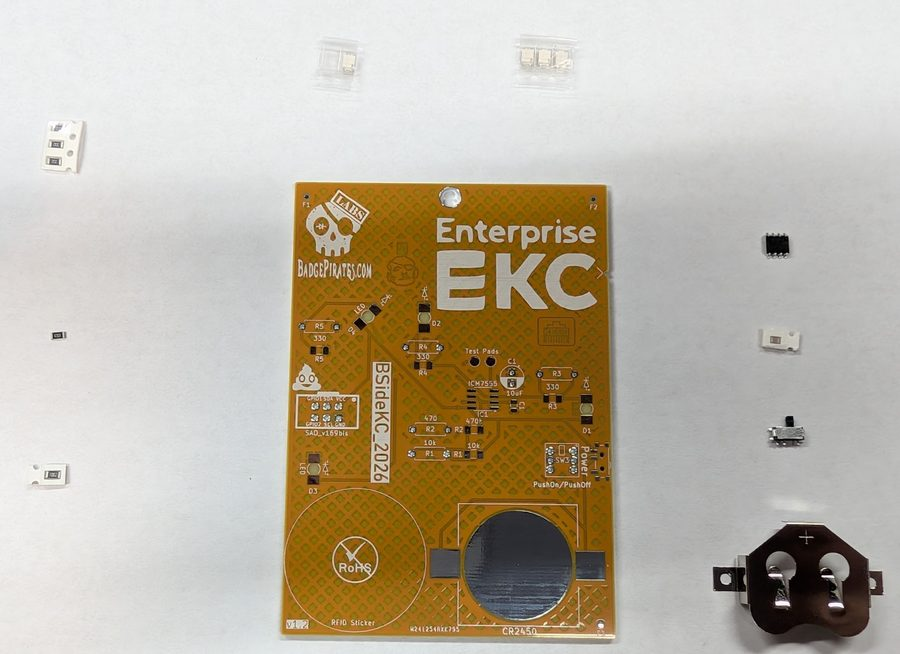
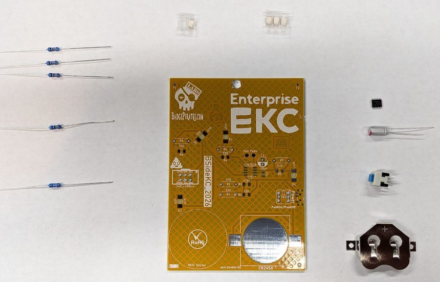
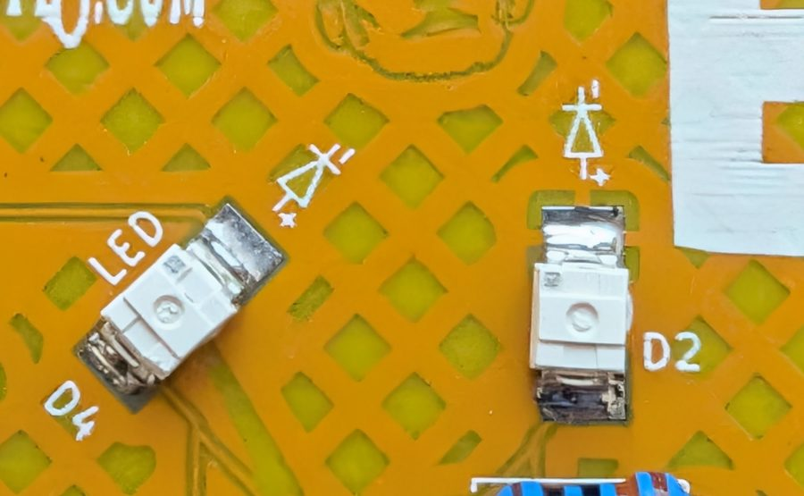
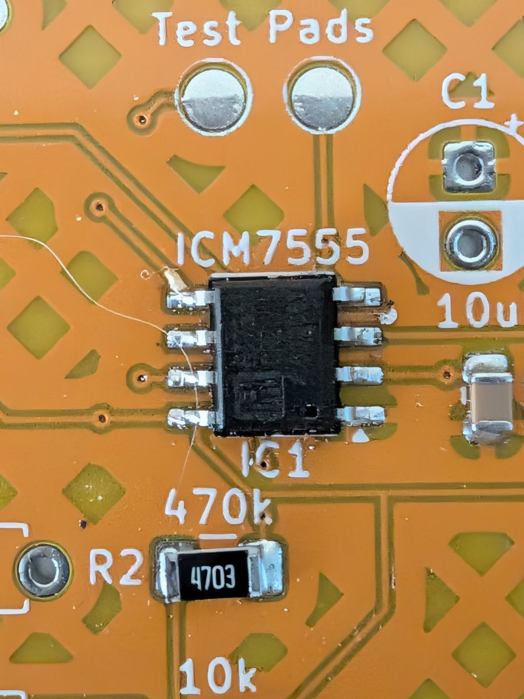
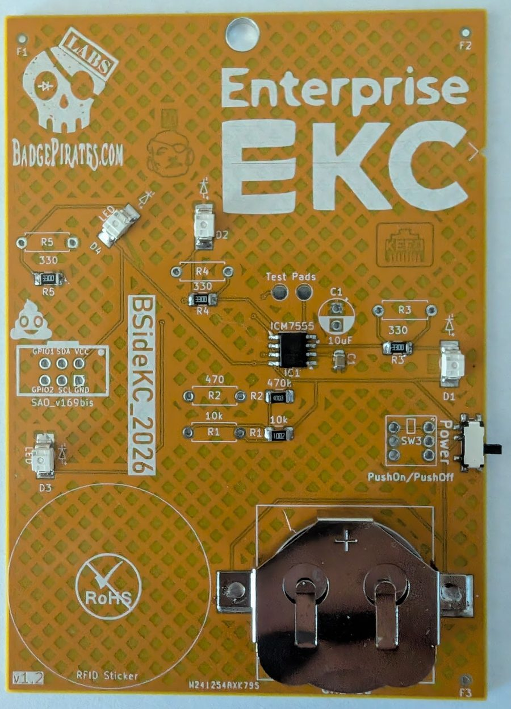
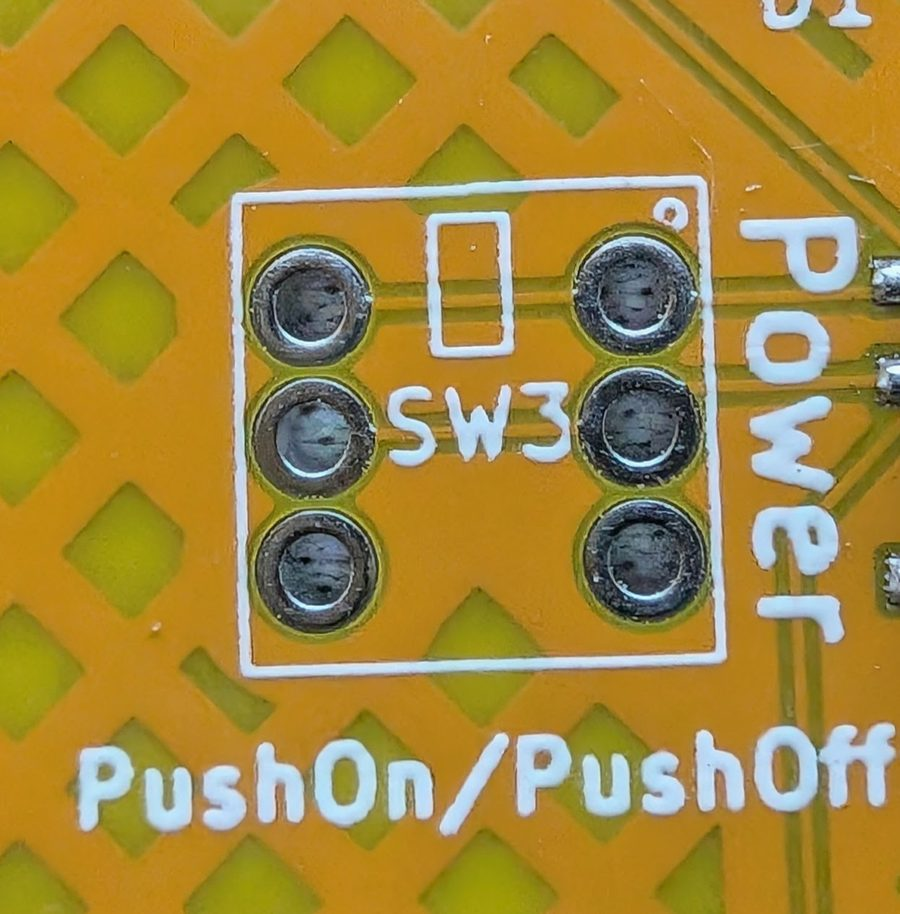
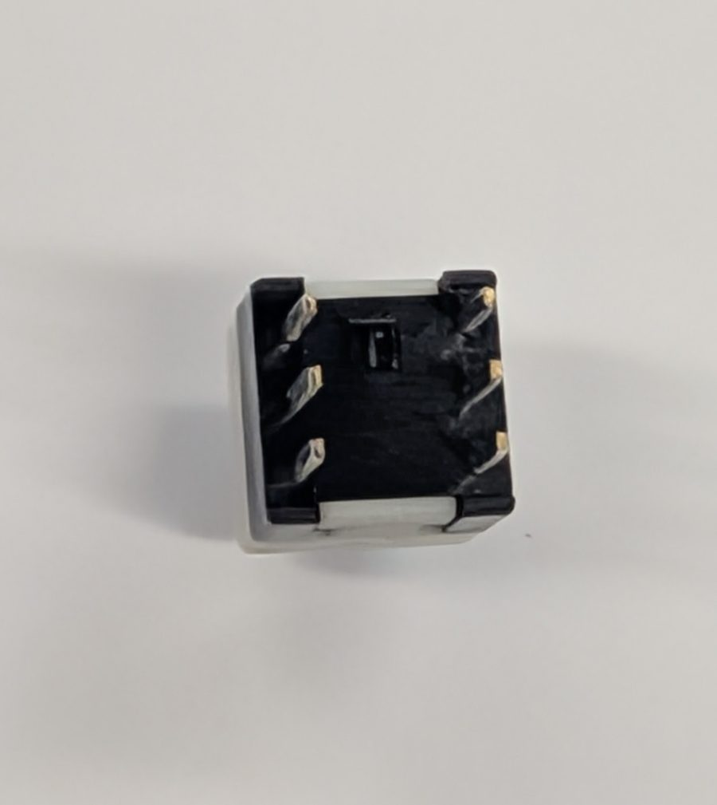
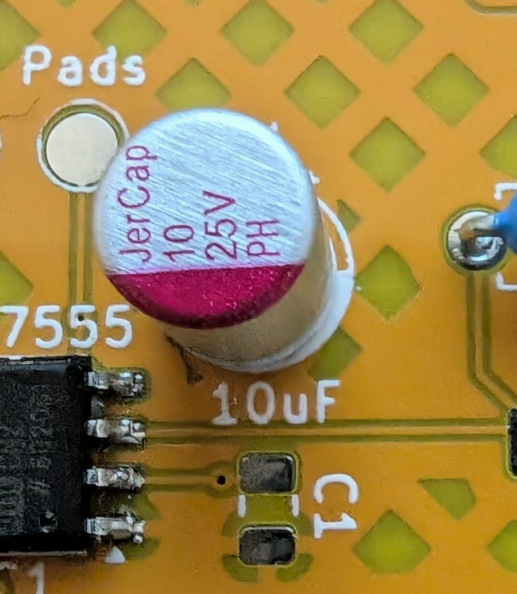
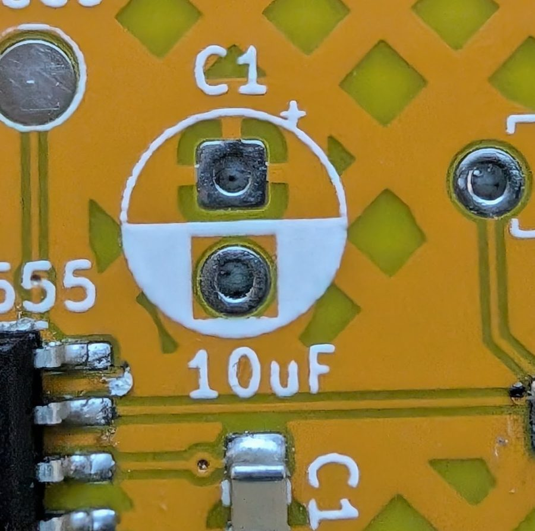
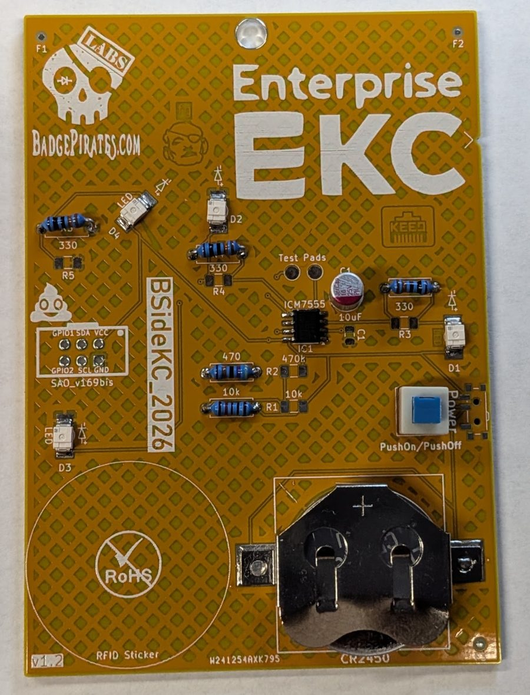

# BSidesKC 2026 Badge Build Guide

This guide covers assembly of the BSidesKC 2026 badge, which comes in two versions: **SMD** (Surface Mount Device) and **Through Hole**. Both share a common set of components with version-specific differences for resistors and the switch.

---

## Component List

### Common to Both Versions

| Qty | Component |
|-----|-----------|
| 3 | Yellow Reverse Mount LED |
| 1 | Red Reverse Mount LED |
| 1 | Battery Holder |
| 1 | 7555 Timer |

### SMD Version

| Qty | Component | Marking |
|-----|-----------|---------|
| 1 | 10µF Capacitor | — |
| 3 | 300Ω Resistor | `3300` |
| 1 | 470Ω Resistor | `4703` |
| 1 | 10kΩ Resistor | `1002` |
| 1 | Slide Switch | — |

### Through Hole Version

| Qty | Component | Color Code |
|-----|-----------|-----------|
| 1 | 10µF Capacitor | — |
| 3 | 300Ω Resistor | Orange, Orange, Black, Black, Brown |
| 1 | 470Ω Resistor | Yellow, Violet, Black, Black, Brown |
| 1 | 10kΩ Resistor | Brown, Black, Black, Red, Brown |
| 1 | Push Button Switch | — |

---

## Assembly — Both Versions (SMD First)

Regardless of which version you're building, start with the SMD components. It's easier to solder the surface mount parts before adding through hole parts.

### Step 1 — Apply Solder Paste

Apply paste to the pads for:

- Each LED
- All 8 pins of the 7555 Timer
- Side pads of the Battery Holder (skip the center round pad)

### Step 2 — Place the LEDs

1. Place the **Red LED** on the diagonal LED position, with the **dot on the LED pointing up** (toward the top of the board).
2. Repeat for all **3 Yellow LEDs**.

### Step 3 — Place the 7555 Timer

The chip has a **dot marking pin 1**. Match this dot to the corresponding dot on the board's silkscreen — located in the **lower right** of the component footprint.

### Step 4 — Place the Battery Holder

Set the battery holder on its pads.

### Step 5 — Solder the SMD Components

Using a hot air station, reflow oven, or soldering iron, solder each pad. Work slowly — heat each pad until the solder melts rather than rushing.

---

## SMD Version — Continue Here

> **Through Hole builders:** skip ahead to the [Through Hole section](#through-hole-continuation) below.

Continue with paste, placement, and soldering for the remaining SMD components in this order:

6. **1x 10µF Capacitor**
7. **3x 300Ω Resistors** — marked `3300`
8. **1x 470Ω Resistor** — marked `4703`
9. **1x 10kΩ Resistor** — marked `1002`
10. **Slide Switch**
11. Install the battery and power on.

---

## Through Hole Continuation

### Step 1 — Place the Switch

Look inside the switch body — you'll see a small box on the top side. **Match this box to the silkscreen box on the board.** Place and solder.

### Step 2 — Place the Capacitor

The **red stripe** on the capacitor matches the **white-filled side** of the capacitor outline on the silkscreen. Place and solder.

### Step 3 — Place the Resistors

Direction does not matter for resistors. Place and solder in any order:

- **3x 300Ω resistors**
- **1x 10kΩ resistor**
- **1x 470Ω resistor**

### Step 4 — Power On

Install the battery and turn it on.

